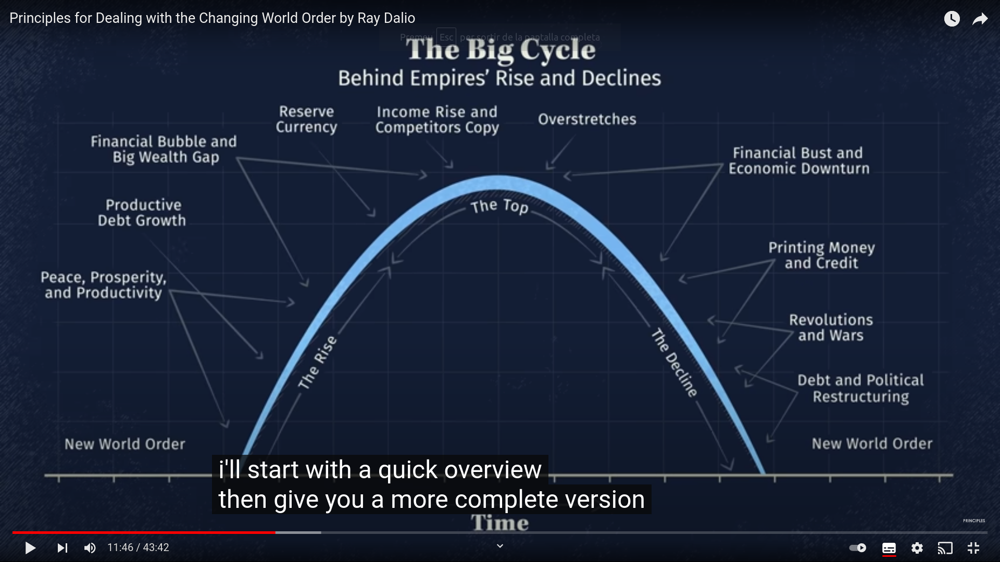
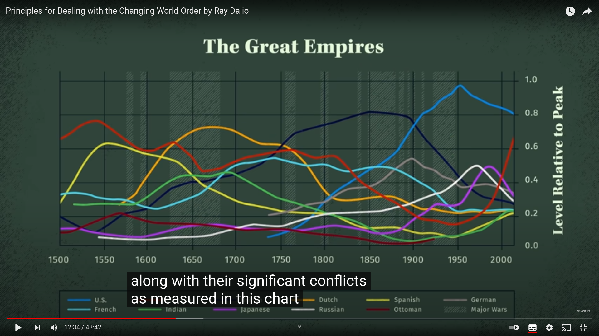

Reference https://www.youtube.com/watch?v=xguam0TKMw8

- At the end of the lifetime of a world's superpower supremacy, the same pattern ensues: 
  - The goverment issues more debt that it can pay [[debt is backed by gold]], [[growth obligation]]
  - All countries think that goverment won't be able to pay the promises, so they rush to cash out
  - The goverment reacts by cancelling the promise: no more exchange of money for gold
  - The goverment prints more money, which drives inflation way up
    - Principle: when this happens, accumulate in gold or commodities, not in currency

Changes in internal world orders: when new constitutions are written
- China in 1949 when the comunist party wins the civil war
- [[Bretton Woods agreement]]

- The Big cycle 

[[collapse of complex societies]]
[[panarchy]]

- Rise: education (maybe even top down education?) plays a big role in internal coherence
  - Education -> Innovation -> Competitiviness -> Growing economic output -> share of world trade -> investments in education, innovation, entrepreneus -> [[reserve currency]] -> governments can print more paper because of network effect, everyone is using it
  - Positive feedback loop: invention & development -> profit -> investment in invention & development via stock, bond and lending markets. (here invention & development can be maybe substited by untapped energy niches?)
  - Capitalists, government and military need to work together -> [[requisit variety]]
  - Dutch empire in 1600s:
    - Invented ships
    - Invented capitalism ([[birth of capitalism]]) to finance expeditions for those ships
- Fall
  - negative feedback loop: citizen of global power is better educated and have greater goods and needs meet -> citizen is more expensive -> they lose Competitiviness in front of workers from other countries -> global power reduces power 
  - Other countries copy the technology of the global power
  - [[assabiyah]]: 
  - [[simple to chaos breakdown]]
  - Internal fighting [[wealth gap]]
  - Costly external fighting
  - First gradually, then very rapidly 
  - Financial bubble -> the debt is what sustains the growth, and people only want to take on debt if they trust that country 
    - Underlying limit is how much the country phisically has
  - [[s curves]]
  - tax to the riches increase, which makes the rich go away to other countries, which weakens the global power
  - Revolution to balance things
  - Massive dollar buyout hasn't happened yet

[[nate hagen: untapped niches of energy]]
[[weeds]] [[sere]]